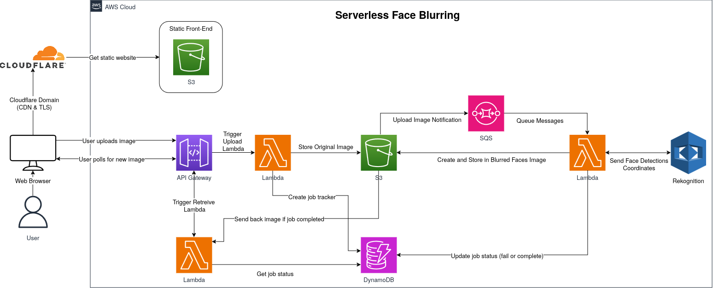

# AWS Serverless Image Face Blurring

Serverless application that blurs faces in an image using AWS services (Rekognition, S3, SQS, etc.).

## Demo

TODO.

## Tech Stack

### AWS Infrastructure

#### Upload Image Process

- API Gateway + Lambda + S3 + DynamoDB: Store user uploaded image, create job tracker
- SQS + Lambda + Rekognition: Create message queue, trigger Rekognition to detect faces on upload
- Rekognition + Lambda + S3: Detect face pixel locations, apply blur to faces on image, stores blurred image on S3, update job tracker

#### Retrieve Image Process

- API Gateway + Lambda + DynamoDB + S3: Periodically check job progress, returns image back to user when completed, returns error otherwise

#### Front-End

- User chooses image to upload, triggers PUT request through API
- After upload, website will poll every few seconds for job update until completed, then show new image to user available to download

### Languages/Frameworks/Libraries

- Front-End
  - HTML
  - CSS + Bulma Framework
  - Javascript
- Lambda
  - Python (Pillow + Boto3)
- IaC
  - Terraform
