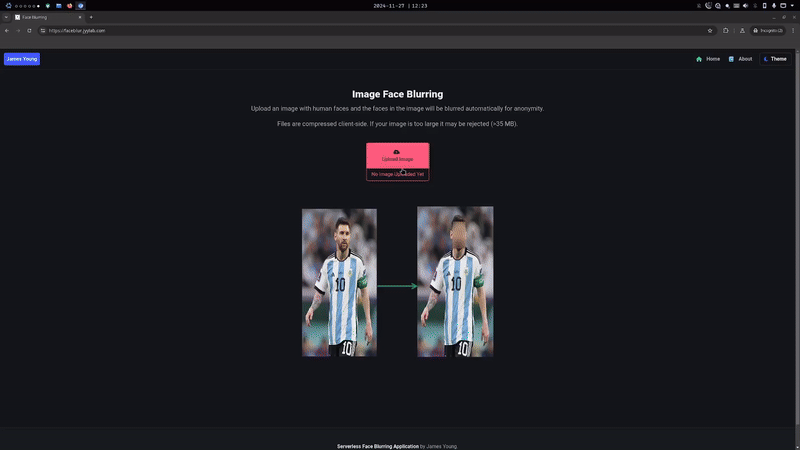
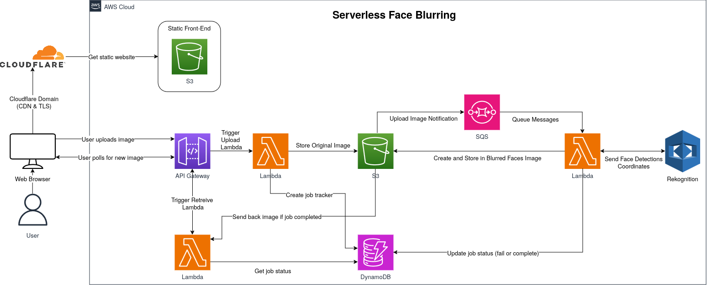

# AWS Serverless Image Face Blurring

Open-source serverless event-driven application that blurs faces in an image using ReactJS, AWS services (Rekognition, S3, SQS, Lambda, DynamoDB, API Gateway), Github Actions for CI/CD, Terraform for deployment.

Application website: [https://faceblur.jyylab.com](https://faceblur.jyylab.com).

## Demo



Website: [https://faceblur.jyylab.com](https://faceblur.jyylab.com)

## Tech Stack

### AWS Infrastructure



### Languages/Frameworks/Libraries

- Front-End
  - ReactJS
  - Bulma CSS Framework + CSS
  - NPM Libraries
    - CompressJS (for compressing images client-side)
    - FontAwesome
    - Bulma CSS
- Lambda
  - Python (Pillow + Boto3)
- IaC
  - Terraform

#### Front-End

Front-End uses ReactJS and styled with Bulma CSS framework. Users upload image which will be encoded in base64 and sent to API Gateway via a POST request. Since API Gateway has 10 MB payload limit, I used CompressJS to compress images client-side so that users can upload larger images (max I tried was 35 MB image that compressed down to 5 MB). Once user sends it, the website will poll every 4 seconds for the job status and if the job is completed it will return the image with a pre-signed URL from S3.

#### Upload Image Process

Once API Gateway receives the payload, it is processed with Lambda via proxy integration. The Lambda reads the encoded base64, converts it back to an image, then stores it in S3 (auto-deletes everyday). A job with a jobID is created in DynamoDB to track its progress.

#### Blur Image Process

Once an image is uploaded to S3, it creates an event for SQS and will put it in a queue. A Lambda functions polls for the queue, and will read the message which contains the image key (filename and path). The Lambda function calls Rekognition detect face API which returns any human faces detected and their bounding box coordinates. Using the coordinates, I used Python Pillow's `GaussianBlur` function to blur the region and store it back into the S3 bucket. The job is then updated in DynamoDB and marked as complete.

#### Retrieve Image Process

Users poll for the image job status via the API and Lambda every few seconds. The Lambda function returns the job status and will also return a S3 pres-signed URL to view the image if the job is complete.

#### Event-Driven Processing

As mentioned above, SQS is used to create events and queue them for processing from Rekognition. This allows for retries when a request fails so that the image blur request can eventually be fulfilled.

## Build Project for Yourself

### Prerequisites

- AWS account w/ associated credentials that allow you to create resources
  - With free tier this application can be free since Rekognition allows a few thousand face detections for free each month
- Terraform CLI
- Cloudflare domain + API Token (Zone.Page Rules, Zone.DNS permissions)

### Build Instructions

Clone repo:

``` bash
git clone https://github.com/jamesyoung-15/aws-serverless-face-blurring
```

Overwrite existing Terraform variables (aws_profile, domains, api token, etc.):

``` conf
aws_profile          = "Default"
site_domain          = "yourdomainwithCloudflare.com"
... Other variables ...
cloudflare_api_token = "yourCloudflareAPIToken"
```

Deploy with Terraform, take note of API:

``` bash
terraform init
terraform plan
terraform apply
```

Add API created by Terraform to front-end in `front-end/src/ImageUploader.jsx` (better to add this to a secrets/env file to hide API rather than what I'm doing):

``` js
... Output Omitted ...
const api = "yourapi.region..amazonaws.com/prod"
const uploadApi = `${api}/upload`;
const jobsApi = `${api}/jobs`;
... Output Omitted ...
```

Install front-end dependencies and test locally:

``` bash
cd front-end
npm install
npm run dev # if this works proceed
```

Build React and sync `dist` to S3 bucket (bucket name is your site domain) to serve site:

``` bash
npm run build
# can test with serve -s dist, requires npm serve package
aws s3 sync ./dist s3://faceblur.yourdomain.com --delete --profile default
```

Test your domain, anytime you make changes sync S3 bucket and consider clearing Cloudflare and local cache to see changes immediately.

## Self-Hosted Project

For a completely self-hostable open-source implementation (no Cloud services), see my old project [here](https://github.com/jamesyoung-15/serverless-face-blurring), where I used OpenFaaS in place of Lambda, MinIO instead of S3, and MTCNN instead of Rekognition. This implementation does not use event driven architecture as above.

## Potential Todo

Current project kinda low complexity (albeit supposed to just be mainly for learning), can expand with:

- Add video face-blur support (note: free tier Rekognition is 60 min per month, may need to self-host)
- Login support w/ persistent storage
- Custom image manipulation tools (cropperjs w/ some other tools?)
  - Custom crop, custom blur, image impainting, etc.
